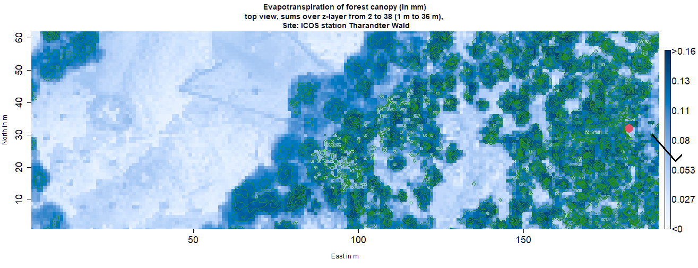

# Table of contents<a name="toc"></a>

1.  [Introduction](#Introduction)
    -   [Interception](#Interception)
    -   [CanWat model-definition and capabilities](#CanWat%20model-Definition%20and%20Capabilities)
2.  [Quick Start Tutorial](#Quick%20Start%20Tutorial)
    -   [CanWat requirements](#CanWat%20Requirements)
    -   [Step by step practical example](#Step%20by%20step%20Practical%20example)
3.  [CanWat Model structure](#General%20approach)
4.  [Model parameters](#Model%20parameters)
5.  [Model input data](#Model%20input%20data)
6.  [Model output](#Model%20output)
    -   [Standard output](#Standard%20output)
    -   [Individual output](#Individual%20Output)
7.  [Theory](#CanWat%20model%20Theory)
    -   [Single approaches](#CanWat%20model%20assumptions)
    -   [Model assumptions](#CanWat%20model%20assumptions)

# [1 Introduction](#toc) <a name="Introduction"></a> 

## [Interception](#toc) <a name="Interception"></a> 

Interception is that part of precipitation that is captured by vegetation and is evaporating back into the atmosphere. The interception process has a significant influence on the availability of water in ecosystems. Up to 50 % of precipitation in forest ecosystems evaporates via interception and is not available to plants.

# [2 Quick Start Tutorial](#toc) <a name="Quick Start Tutorial"></a> 

## [CanWat Requirements](#toc) <a name="CanWat Requirements"></a>

CanWat can be downloaded from the Git repository as a packed file. Go to <https://github.com/Ron-Q/CanWat.git>. Click "<> Code" Button at the top and "Download ZIP". The package contains the preferable folder structure and the source code. Please unpack the files in any folder and remember it, as it is the CanWat home folder. 
It comprises the following parts:
 - "Case" - folder: -skripts that describe the input and output 
 - "Docs" - folder: Documentation 
 - "Driver dynamic" - folder: Meteorological data for input 
 - "Driver static" - folder: Site data (plant area density) for input 
 - "Output" - folder: Output of the simulations
 - "Sub" - folder: CanWat source code
 - "CanWat_start.R": User interface to start CanWat

The preparation of the input files (case description, dynamic driver and static driver) can be done with any appropriate editor, before the running CanWat from any environment (RStudio is recommended). A detailed description of content and structure of the input files can be found in Section [Model input data](#Model%20input%20data) or can be adopted from examples shipped with the source code.

## [Step by step Practical example](#toc) <a name="Step by step Practical example"></a>

### STEP 1. Prepare environment
Install [R](https://cran.rstudio.com/) on your machine, we recommend further the use of [Rstudio Desktop](https://posit.co/download/rstudio-desktop/) as integrated development environment.

The basic CanWat procedures need only the  packages **"data.table"** and **"png"**. Furthermore, the user defined output of some examples have use of some additional packages. The following line will install the necessary packages
`R lapply(c("data.table", "png", "rasterImage", "colorRamps"), install.packages, character.only = TRUE)`

### STEP 2. Names and paths 
 - If you use Rstudio, open CanWat.proj 
 - open CanWat_Start.R, 
 - go to section "#\* Paths and subroutines" and add a new line to the "switch"-list and place the name of your machine/computer and the main path of CanWat in it 
   - you may get the name of your computer by running the command: "Sys.info()["nodename"]"
   - An easy and save way to get the home path of CanWat is to navigate to the folder in your file commander/explorer and copy the path and run the command "gsub("\\\\","/", (readClipboard()))" to change back slashs to slashs
```R 
switch(Sys.info()["nodename"] 
       , "rq-ThinkPad-T460p" = {hpath <- "/mnt/589xyz/R_lib/CanWat/"}              # RQ linux 
       , "FMELAP78"          = {path.CW <- "d:/b_Programming/0_R_lib/y_CanWat"}    # IHM met laptop
       , "your machine/computer" = {hpath <- "your home path"}   # replace with your structure
      )
```

### STEP 3. Assign a case 
Within Section "#\* name a case/incident" in CanWat_Start.R you need to assign a case name to variable "act". There are some examples of cases listed as comments. To test them you just need to un-commend the line. CanWat will always call the selected case from the case folder by extending the name with "\_input.R" 

```R 
#* name a case/incident #### act <- "Case01_Tree01_1D_01L" # act <- "Case01_Tree01_1D_02L" # act <- "Case01_Tree01_1D_03L" # act <- "Case01_Tree01_1D_04L" # act <- "Case01_Tree01_1D_05L" # act <- "Case01_Tree01_1D_10L" # act <- "Case01_Tree01_2D_10L" # act <- "Case01_Tree01_3D_10L" # act <- "Case02_Tree01_1D_20L" # act <- "Case02_Tree01_3D_20L" # act <- "ASTW_intChute_2010_0D" # act <- "ASTW_intChute_2010_3D" # act <- "ASTW0_exmpl_07"
```

### STEP 4. Run the model 
To start a simulation with "CanWat_Start.R" you have different options:
 - in cmd window, navigate to your CanWat folder and start R. Then type command: *source("CanWat_Start.R")*, 
 - in Rstudio, open *CanWat_Start.R* and press Ctrl+Shift+Enter or click on the "Source" button 
Depending on the switches in the case file, CanWat shows the progress in the console and/or in a control plot. Finally, spatial mean values of water and energy balance are integrated and printed and/or plotted in the control plot.


The majority of information is given in the Output folder. There you will find a sub-folder with the name of the case that contains the Standard-output (see section [Model output](#Model%20output)) and a further a sub-folder with name "usr_output" that contains the user defined output.
Each run has a unique time stamp which is added to the output files.                                                                                                                                                                                                                              

# [3 Canwat model structure](#toc) <a name="General approach"></a>

In the current stage, CanWat is used in interpreter mode, i. e. there is no compiled version. Users prepare their input files with any appropriate editor and start the program CanWat from any environment (RStudio is recommended).

The time step of the simulation is variable and automatically calculated according to the actual water fluxes within the domain. The water balance equation is solved numerically applying a Runge-Kutta approach (4th order) within each voxel.

High spatio-temporal resolution allows the assignment of the simulation results to individual throughfall collectors, as well as the comparison with micro-meteorological measurements of evapotranspiration from a larger footprint area. The required detailed vegetation model can be derived from terrestrial laser scans (Bienert et al. 2010, Queck et al. 2012).

The interception process consists of two interwoven parts, the water balance, and the energy balance, they are connected by evaporation. The latter is driven by the energy input from sensible heat and from radiation, which is mostly low during rain events. Therefore, evaporation depends mainly on the sensible heat flux, which is a function of aerodynamic conductance, i.e., wind speed, temperature, and water vapour pressure. The interception of falling water as well as the meteorological conditions for the evaporation of that water depend on the spatial distribution of vegetation. I.e., in forests all these quantities are spatially highly variable.

In the current stage CanWat has elements of a revised Rutter Model. However, it simulates the water balance within the canopy using a cascade of storages. The depletion of the storages is simulated by an exponential drainage approach and by the evaporation calculated by a form of the Penman-Monteith (PM) equation. The latter combines the flux-gradiant equation and the energy balance to eliminate the surface temperature, which is mostly unknown. The variability of the necessary meteorological quantities within the canopy is modeled by a special module for each quantity. Based on measurements the wind distribution is modeled using a mixing length approach (and - in development - a diagnostic wind field model which assures the continuity of mass). It includes a radiation transfer module that provides the distribution of radiative energy as well as of shortwave radiation. The latter is used for the calculation or the canopy conductance and so the transpiration, which also consumes a small part of the available e#nergy during and after rain events. The variability of temperature and water vapor pressure is estimated by interpolation of measurements currently. A module that includes the energy storage of the vegetation material is planed.

Figure X present an overview of the model structure. The main processes used in a sequence order are Initialization, Data input, Data pre-processing, calculations and final outputs. 

# [4 Model parameters](#toc) <a name="Model parameters"></a>

CanWat requires several parameters to generate a spatial representation of the meteorological variables, but also to simulate drainage and the resistance against evaporation. They are described in the script \~/sub/CW_parameter.R, where the user can also change it.

Table (XX) describes different CanWat parameters for interception prediction:

|               | Parameters | Description |
|---------------|------------|-------------|
| Wind field    |            |             |
| Precipitation |            |             |
| Evaporation   |            |             |
| Radiation     |            |             |
| Resistance    |            |             |
| Plants        |            |             |
| Drainage      |            |             |
| Model         |            |             |

Wind field, Precipitation,Evaporation, Radiation,Resistance,Plants and Drainage

------------------------------------------------------------------------

# [5 Model input data](#toc) <a name="Model input data"></a>

In the current stage, CanWat is used in interpreter mode, i. e. there is no compiled version. Users prepare their input files with any appropriate editor and start the program CanWat from any environment (RStudio is recommended).

Several inputs are necessary to individualize the CanWat run. The runs are controlled by information given in \<case\>\_input.R and \<case\>\_output.R files in the Cases folder. The domain (i.e. the boundary conditions) is defined by a Static Driver and the meteorological conditions should be provided by a Dynamic Driver. Furthermore, one can adjust the parameter settings in CW_parameter.R

## Case files

The variable "act" that is defined in CanWat_start.R controls the selection of the input and output files in the folder "Cases".

### \<case\>\_input.R

This is the main input file, which describes the individual Dynamic and Static Drivers, and sets switches for the output. Please see the examples that are given within the *Cases* Folder. Almost each line is completed by a comment, thus these files are self-explanatory. The best way to start is to copy an example under a new name and make desired changes.

The \<case\>\_input.R has three sections. The first describes the Static Driver, the second the Dynamic Driver and the third the Output.

``` r
# ~~~~~~~~~~~~~~~~~~~~~~~~~~~~~~~~~~~~~~~~~~~~~~~~~~~~~~~~~~~~~~~~~~~
# STATIC DRIVER ####################################################
# ~~~~~~~~~~~~~~~~~~~~~~~~~~~~~~~~~~~~~~~~~~~~~~~~~~~~~~~~~~~~~~~~~~~
  #* name and range ####
  fnam.SD <- "ASTW_PAD_3D.csv" # -, name of the static driver
  SD.dims = c( 1, 1,  1)      # -, [z,y,x]  dimensions
    ...  
  #* position of the reference point 
  xref.UTM <- 0                # m, East coordinate of the reference point
    ...  
  #* region  of interest ####
    ...  
  # correction/clumping factor for PAD  (called in Load_Static_Driver.R )
  PADfunction <- function(PAD){ PAD/dz + 0 }
  #==> hier one can design an adaptation if the Dynamic Driver holds a proxi instead of the plan area density. 

# ~~~~~~~~~~~~~~~~~~~~~~~~~~~~~~~~~~~~~~~~~~~~~~~~~~~~~~~~~~~~~~~~~~~
# DYNAMIC DRIVER - Meteorolocial Data ################################
# ~~~~~~~~~~~~~~~~~~~~~~~~~~~~~~~~~~~~~~~~~~~~~~~~~~~~~~~~~~~~~~~~~~~
  fnam.MetData <- "exmpl_07.csv"  # -, name of the dynamic driver
  dt_met <- 600                     # s, length of a time step
    ...

# ~~~~~~~~~~~~~~~~~~~~~~~~~~~~~~~~~~~~~~~~~~~~~~~~~~~~~~~~~~~~~~~~~~~
# OUTPUT DEFINITION #################################################
    ...
# Individual output #########    
  # the following script is called each time step, 
  # it must be located in the case folder
  fnam.out <- "ASTW0_output.R" # paste0(act, "_output.R")  
```

Each input file \<case\>\_input.R should contain a section called "OUTPUT DEFINITION". Within this section several output switches can be set. This settings control the work of "output_timestep.R".

### \<case\>\_output.R

Additionally, you can create an individual script which you name using the variable *"fnam.out"*, this script must be located in the "*Cases*" folder. This script is called at the end of every time step. The user can here define the output of selected ranges, sums, plots etc. individually. An examples are given by "Output_yz-cross-section.R" and "ASTW0_output.R".

## Static Driver

The Static Driver contains the surface distribution within the model domain. Currently only vegetation is regarded. The plant area density PAD should be given in m²/m³, i.e. even if the voxel size is bigger than 1 m³, you should give the average PAD for each voxel.

It has to be stored as a one dimensional vector with highest frequency in z (height above ground), then y and x (thus, z is the most inner loop and x is the outer loop). Anyway, each Static Driver file should be accompanied by a (\<name of the Static Driver\>\_description.txt file, where the origin and processing of the data is described. The Static Driver is loaded by *Load_Static_Driver.R* .

| Input_name               | Description                                                 | Input shape            |
|-----------------|-----------------------------|---------------------------|
| plant area density (PAD) | plant area per unit volume (PAD plant area/ voxel) [m2/ m3] | one dimensional vector |

## Dynamic Driver

CanWat is a dignostic model, thus it needs some meteorological input. The time series of the following quantities should be provided by a dynamic driver. The names of the colums and measurement heights must be assigned to a "namo" variable (given in the following table). The part "namo" indicates here original name. dt stands for the time interval.

| Quantity and Unit      | "namo" variable | height variable | Default Value |
|------------------------|-----------------|-----------------|---------------|
| time                   | namTime         |                 |               |
| precipitation in mm/dt | PP_namo         |                 | NO default    |
| wind speed in m/s      | WS_namo         | hWS             | 0.5 m/s       |
| temperature in °C      | Ta_namo         | hTa             | 15°C          |
| water vapour in hPa    | DD_namo         | hDD             | 15 hPa        |
| net radiation in W/m²  | Rn_namo         | hRn             | 150 W/m²      |
| sw radiation in W/m²   | Rg_namo         | hRg             | 200 w/m²      |

Each of these variables can be provided at different height levels. The measurement height must be given in the input file. Only one vertical profile is considered up to now. According to the requirements of the user the horizontal variability of the meteorological variables may be included. The Dynamic Driver is loaded by *Load_Dynamic_Driver.R* .

# [6 Model output](#toc) <a name="Model output"></a>

## [Standard output](#toc) <a name="Standard output"></a>

CanWat model output consist of multiple files containing tables and charts. It is saved in the "\~/Output/\<case\>" folder. As a basis, cumulative sums of the water balance are calculated and saved as csv tables.

-   "\<case\>\_journal\_\<timestamp\>.md": is a protocol for the run where all important controls and parameter are listet
-   "\<case\>\_\<timestamp\>.png": is the control plot, that includes also the mean water and energy balance
-   "\<case\>\_WB\_\<timestamp\>.csv": contains values for the same time steps as the input.
-   "\<case\>\_WBa\_\<timestamp\>.csv": contains all calculated time steps.

The standard output variables in the "csv" tables are given in the following table. The values are spatialy averged mean fluxes in mm per timestep (ts), except C_3D which is the mean storage content. The unit "mm" is equal to "l/m²" and using the latent heat of vaporisation ($L(10°C) \approx 2477$ kJ/kg) also a measure for the energy transfer. The selection can be adjusted in the case file by the variable *heado* or in the CanWat_start by the variable *output.mean.usr*.

| Variable     |     | Unit    | Description                        |
|--------------|-----|---------|------------------------------------|
| *UTC*        | in  | s       | start time of the time interval    |
| *dt*         | in  | s       | length of the time interval        |
| *C_3D*       | in  | mm      | current canopy storage per voxel   |
| *dC*         | in  | mm/*dt* | change of the storage              |
| *PF*         | in  | mm/*dt* | gross precipitation                |
| *Pintercept* | in  | mm/*dt* | intercepted precipitation          |
| *Pthroughf*  | in  | mm/*dt* | throughfall from rain (direct)     |
| *ET*         | in  | mm/*dt* | transpiration                      |
| *EV*         | in  | mm/*dt* | evaporation                        |
| *Drainage*   | in  | mm/*dt* | drainage (water in the canopy air) |
| *Dintercept* | in  | mm/*dt* | reintercepted water from drainage  |
| *Dthroughf*  | in  | mm/*dt* | throughfall from drainage          |

Please note, that the Drainage describes the water which is in the air at the end of the time step. At the beginning of the next time step Drainage is distributed and lands either on the plant surface again (Dintercept) or falls through the bottom of the domain Dthroughf. Thus, at a certain time step i. Drainage(i-1) = Dintersept(i) + Dtroughf(i)

A rough overview of the input and output is given by the Figure in file "(case(timestamp).jpg"

## [Individual Output](#toc) <a name="Individual Output"></a>

Within "\\Output\\\<case\>\\\<case\>\_usr_output\_\<timestamp\>" you can find the results of the "\<case\>\_output.R" script. The script must be located in the "*Cases*" folder, an examples is given by "ASTW0_output.R". It is called each time step.

Note: Canwat works internally with an additional model layer at the bottom. If you output 3D field at the end of the time step you need to delete it.

The following figure was created with the example "ASTW0_output.R"



# [7 CanWat model Theory](#toc) <a name="CanWat model Theory"></a>

## [Single approaches](#toc) <a name="Single approaches"></a>

## [CanWat model assumptions](#toc) <a name="CanWat model assumptions"></a>

Test
